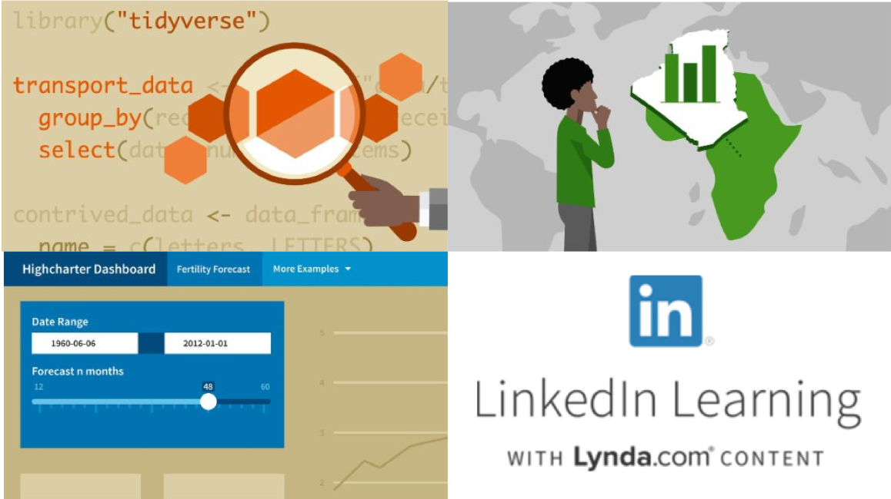

```{r setup, include=FALSE}
knitr::opts_chunk$set(echo = FALSE)

# Learn more about creating websites with Distill at:
# https://rstudio.github.io/distill/website.html

```


<d-byline></d-byline>

<center></center>

<center><h2>Charlotte Joey Hadley</h2></center>

Hello! I'm an R instructor and data science consultant. This is a portfolio of my courses, charts and other things that don't have a good home elsewhere. I'm also an Open Data and Reproducible Research evangelist. :smile:

I also happen to be trans. All tech is political and our common future requires [intersectionality](https://time.com/5560575/intersectionality-theory/). 

## Training: #rstats and Data Science

<div>



<span style='color:darkgrey;'>LinkedIn Learning Courses:</span> I've been producing courses for LinkedIn since 2016. These courses are included with a LinkedIn Premium subscription or can be purchased a la carte. Out of my 5 courses I particularly recommend:

- [Building data apps with shiny](https://www.linkedin.com/learning/building-data-apps-with-r-and-shiny-essential-training)

- [tidyverse intro](https://www.linkedin.com/learning/learning-the-r-tidyverse?u=2125562)

- htmlwidgets

</div>

And this is here now.
